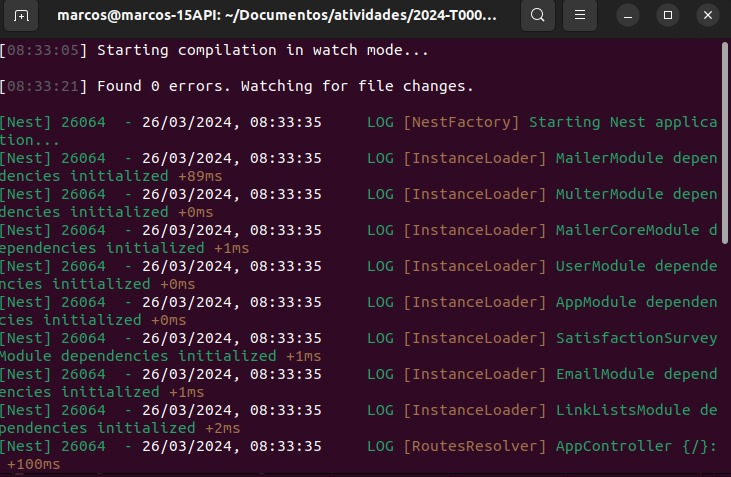
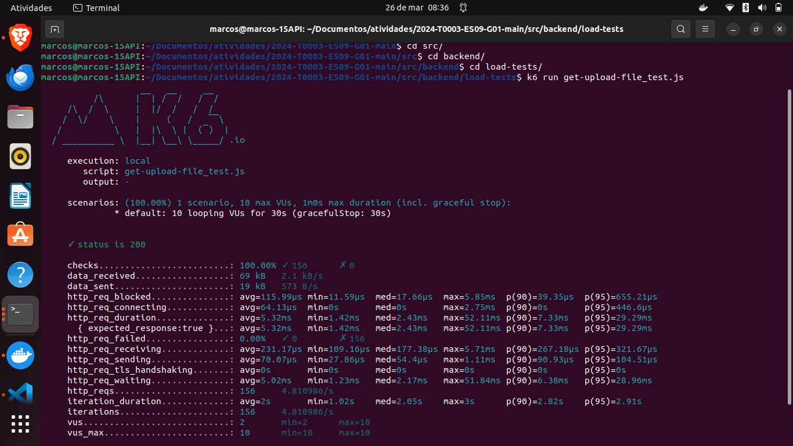
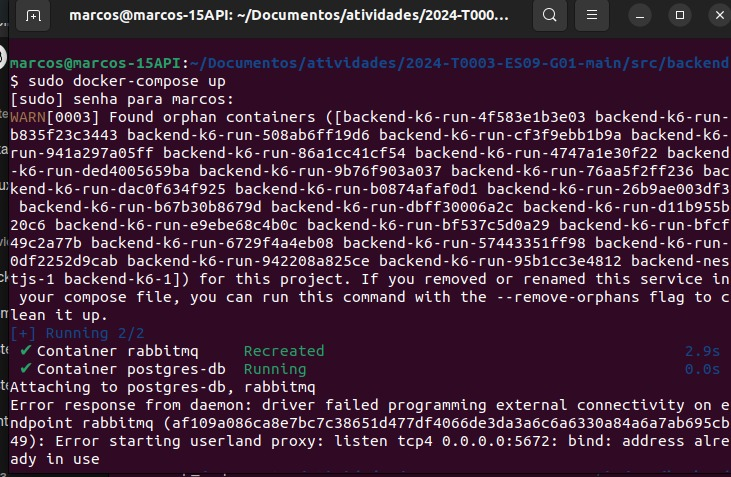

**Relatório de Aprendizado sobre o Uso do K6 para Testes**

Gostaria de compartilhar algumas das principais lições aprendidas ao explorar o K6 para testes de desempenho.

**1. Configuração Simples e Flexível:**
   O K6 possui uma sintaxe JavaScript simples, facilitando a configuração de testes de desempenho, mesmo para iniciantes.

**2. Simulação Realista de Usuários:**
   A capacidade do K6 de simular o comportamento de usuários reais é impressionante, permitindo a modelagem de cenários de uso autênticos.

**3. Métricas Abundantes:**
   O K6 oferece uma variedade de métricas para avaliar o desempenho do sistema de forma abrangente, indo além do tempo de resposta das solicitações.

**4. Integração com Ambientes de Automação:**
   A integração do K6 com pipelines de CI/CD simplifica a automação dos testes de desempenho, garantindo que sejam parte essencial do ciclo de desenvolvimento.

**5. Análise de Resultados Detalhada:**
   Os relatórios HTML e os gráficos gerados automaticamente pelo K6 facilitam a identificação de gargalos de desempenho e áreas de melhoria.

---

**Explicação do Teste de Carga:**

Em resumo, o teste realiza o seguinte:

1. **Importa as Bibliotecas Necessárias:** Importa as bibliotecas do K6 necessárias para realizar solicitações HTTP e verificar as respostas.

2. **Configura as Opções do Teste:** Define o número de usuários virtuais a serem simulados (`vus`) e a duração do teste (`duration`).

3. **Define a Função de Teste:** A função de teste realiza as seguintes ações para cada usuário virtual:
   - Realiza uma solicitação GET para o URL especificado, que neste caso é um arquivo CSV em `http://localhost:3001`.
   - Verifica se a resposta da solicitação possui o status 200 (OK).
   - Adiciona uma pausa aleatória entre 1 e 3 segundos, simulando um comportamento mais realista dos usuários.

Este teste permite simular o acesso simultâneo de múltiplos usuários a um determinado recurso, permitindo avaliar o desempenho do servidor sob carga simulada.

---

Segue em anexo os screenshots solicitados:

1. **Print do Backend Rodando**
   

2. **Print do K6 Rodando**
   

3. **Print do Docker Rodando**
   

